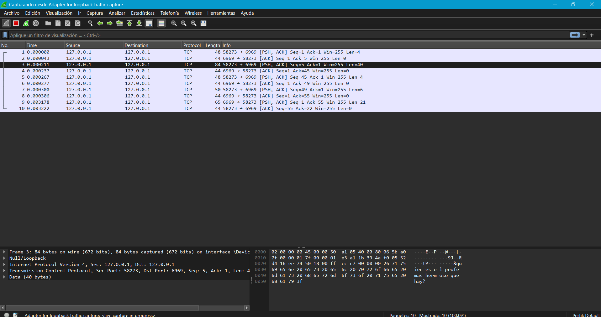

# Ejercicio 1: Análisis de Tránsito de Paquetes con Wireshark (Antes de Encriptación)

Se capturaron los paquetes TCP entre cliente y servidor usando Wireshark, mostrando la información intercambiada en texto plano, como nombres de usuario y mensajes del juego. Esto revela vulnerabilidades de privacidad, ya que cualquier persona en la red puede leer los datos transmitidos.

